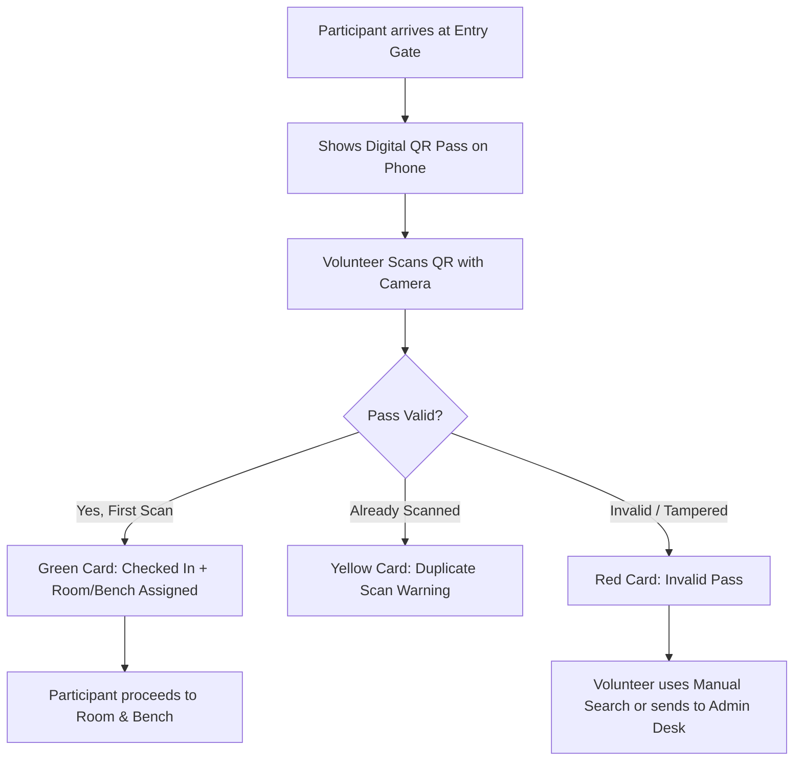
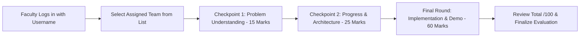

# NeuraX 3.0 — Event Operations & System Workflow Guide

This document defines the end-to-end operational workflow for **NeuraX 3.0 Hackathon**. It is structured for the **Organizing Committee (Admin)**, **Gate Volunteers (Scanners)**, and **Faculty / Jury Members**.

---

## 1. Roles & System Access Matrix

| Role | Portal / Route | Login Requirement | Key Responsibilities |
| :--- | :--- | :--- | :--- |
| **Admin** | `/admin` | Registered Email + Admin Password | Complete control: monitoring check-ins, bench layouts, jury assignments, audit logs, and marksheet export. |
| **Volunteer** | `/volunteer` | Volunteer Passcode (`volunteer` or `neuraxvol`) | Fast gate scanner for scanning participant QR passes, manual email search, and live check-in counting. |
| **Faculty / Jury** | `/jury` | Assigned Username (Passwordless) | Score allotted teams across 3 checkpoints (15 + 25 + 60 = 100 marks), save progress drafts, and finalize evaluations. |
| **Participant** | `/participant` | Registered Email + Event Passcode (`neuraxcmrtc`) | View digital badge, QR entry pass, allotted Room and Bench seat, and team roster. |

---

## 2. Stage 1: Participant Gate Check-In Workflow

### Volunteer Scanner Desk Instructions:
1. Open the browser and navigate to `/login`.
2. Click the **Volunteer** tab.
3. Enter the passcode: `volunteer` and tap **Sign in**.
4. Allow camera permissions when prompted.
5. Point the camera at the participant's QR pass:
   - **Green Card (Success):** Participant is checked in. Direct them to the room and bench shown on screen.
   - **Yellow Card (Already Checked In):** Inform the participant that their pass was already scanned.
   - **Red Card (Invalid Pass):** If camera fails to scan or pass is unreadable, tap **Manual Lookup**, type the participant's email, and tap **Check In**.
6. A live counter at the top displays **Checked In**, **Pending**, and **Total Candidates** in real time.

### Admin Monitoring:
- Admin monitors the live **Pending** counter on `/admin`.
- In `/admin/teams`, filter by **"⚠ Has Pending Members"** to view missing candidates and contact them immediately.

---

## 3. Stage 2: Team & Bench Allocation

- Every registered team is allotted a specific **Room** and **Bench** (e.g. `Lab C-204 · R02-C03`).
- When a participant checks in at the gate, their pass automatically displays their allotted Room and Bench seat.
- **Admin Seat Reassignment:**
  - If a team needs to move rooms or swap benches, Admin opens `/admin/teams` or `/admin/rooms`, selects the team, and updates their room/bench in one click.

---

## 4. Stage 3: Three-Tier Faculty Evaluation Workflow

Each faculty member is allotted contiguous teams of one specific theme (Cyber Security, AI in Industries, or Smart Cities).

### Faculty Scoring Guidelines:

| Evaluation Tier | Max Marks | Focus Criteria |
| :--- | :---: | :--- |
| **Checkpoint 1 (CP1)** | **15** | Problem identification, innovation, approach feasibility, and novelty. |
| **Checkpoint 2 (CP2)** | **25** | System architecture, tech stack, data flow, working prototype progress. |
| **Final Evaluation (CP3)** | **60** | Complete execution, working demo, UI/UX, impact, and presentation Q&A. |
| **Total Marks** | **100** | Cumulative score determining the theme rankings and prize winners. |

### How Faculty Evaluates:
1. Go to `/login` and click the **Faculty** tab.
2. Enter your allotted **Username** (e.g. `s.kiran.cmrtc` or shorthand `s.kiran`). No password needed.
3. Tap **Sign in**. Your dashboard shows your assigned teams and their progress status (`Pending`, `In Progress`, or `Finalized`).
4. Click on any team to open the evaluation sheet.
5. Enter marks and feedback remarks for the current checkpoint:
   - Tap **"Save Progress"** to save drafts at any time during mentoring rounds.
   - Once all 3 checkpoints are scored, tap **"Finalize Evaluation"** to lock the marks.

---

## 5. Stage 4: Admin Control & Result Marksheets

### Admin Jury Inspection:
- On `/admin/jury`, click on any faculty member (or tap **"View Teams"**) to expand:
  - All teams assigned to that faculty member.
  - Scores given for CP1, CP2, Final, and Total.
  - Evaluation status (`Finalized` vs `In Progress`).
  - Buttons to **assign another team** or **unassign a team**.

### Live Leaderboard & Exports:
- Navigate to `/admin/evaluations`:
  - **KPIs:** Total Evaluated Teams, Finalized Count, Average Score, Top Score.
  - **Podium:** Top 3 teams highlighted with gold, silver, and bronze badges.
  - **Filter by Theme:** Switch between Cyber Security, AI in Industry, and Smart Cities.
  - **Export Marksheets:** Tap **"Export All CSV"** or **"Export Finalized CSV"** to download complete Excel/CSV spreadsheets containing team codes, team names, faculty names, checkpoint breakdowns, and total scores.

---

## 6. Quick Reference Credentials

### 1. Admin
- **URL:** `/login` → **Admin** tab
- **Email:** `admin@neurax.dev`
- **Password:** Defined in environment (`ADMIN_PASSWORD_HASH`)

### 2. Volunteer Gate Scanners
- **URL:** `/login` → **Volunteer** tab
- **Passcode:** `volunteer` (or `neuraxvol`)

### 3. Faculty / Jury Logins (9 Evaluators)
- **URL:** `/login` → **Faculty** tab
- **Password:** None (Passwordless)

#### Cyber Security (`NX3-ACS`):
- `s.kiran.cmrtc` (Teams: `NX3-ACS-01` → `NX3-ACS-13`)
- `k.madhu.cmrtc` (Teams: `NX3-ACS-14` → `NX3-ACS-26`)
- `i.kranthikumar.cmrtc` (Teams: `NX3-ACS-27` → `NX3-ACS-38`)

#### AI in Industries (`NX3-AIA`):
- `ch.gopikrishna.cmrtc` (Teams: `NX3-AIA-01` → `NX3-AIA-14`)
- `p.vishnu.cmrtc` (Teams: `NX3-AIA-15` → `NX3-AIA-28`)
- `b.ravindernaik.cmrtc` (Teams: `NX3-AIA-29` → `NX3-AIA-41`)

#### Smart Cities (`NX3-ASC`):
- `b.prashanth.cmrtc` (Teams: `NX3-ASC-01` → `NX3-ASC-17`)
- `g.pavan.cmrtc` (Teams: `NX3-ASC-18` → `NX3-ASC-33`)
- `v.kirankumar.cmrtc` (Teams: `NX3-ASC-34` → `NX3-ASC-49`)

### 4. Participants
- **URL:** `/login` → **Participant** tab
- **Email:** Participant's registered email
- **Password:** `neuraxcmrtc`
